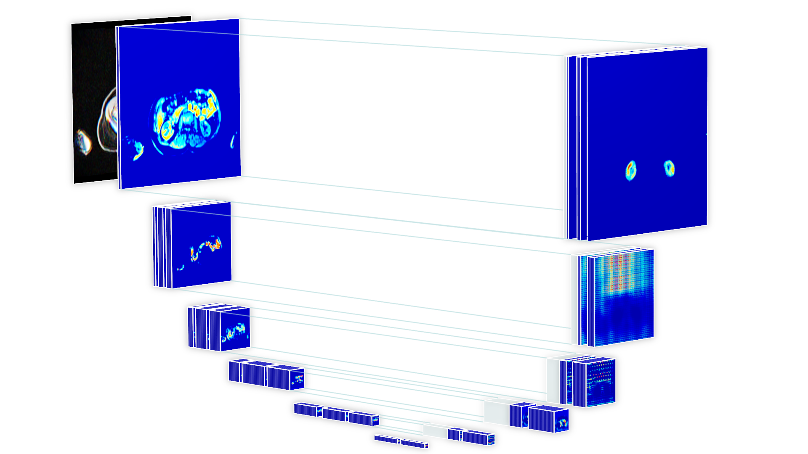

# Neural networks for semantic segmentation of UK Biobank neck-to-knee body MRI

This repository contains PyTorch code for cross-validation and inference with neural networks for kidney segmentation on UK Biobank neck-to-knee body MRI, as described in:  
[_"Kidney segmentation in neck-to-knee body MRI of 40,000 UK Biobank participants"_](https://arxiv.org/abs/2006.06996) [1]

The included inference pipeline and trained snapshot enables measurements of left and right parenchymal kidney volumes (excluding cysts and vessels) from these images.

Contents:
- 2.5D U-Net architecture with residual connections (based on [TernausNet, Iglovikov et al. 2018](https://arxiv.org/pdf/1801.05746.pdf))
- Infrastructure for training and *cross-validation*
- Pipeline for *inference* on neck-to-knee body MRI DICOMs
- Code for *quality_controls* based on numerical metrics
- A [_trained snapshot for parenchymal kidney tissue can be found here_](https://uppsala.box.com/s/lan3d807uqz3rhk6vf7o8u5jjnex4jyp)

For any questions and suggestions, contact me at: taro.langner(at)gmail.com

# Notes
Access to the underlying image data can only be granted by [the UK Biobank Study](https://www.ukbiobank.ac.uk/register-apply/). Annotations from the quality controls used in our work [1] are available under return data ID 2345 for our application 14237. Our measurements and annotations for the kidneys will eventually be made available as well.

# Citation
If you use this code for any derived work, please consider citing [1] and linking this GitHub.

# References

[1] [_T. Langner, A. Östling, L. Maldonis, A. Karlsson, D. Olmo, D. Lindgren, A. Wallin, L. Lundin, R. Strand, H. Ahlström, J. Kullberg, “Kidney segmentation in neck-to-knee body MRI of 40,000 UK Biobank participants,” Scientific reports 10.1 (2020): 1-10_](https://www.nature.com/articles/s41598-020-77981-4)\
